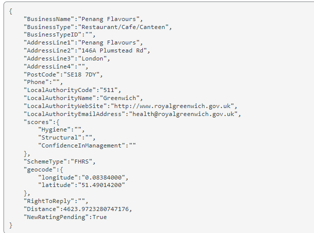
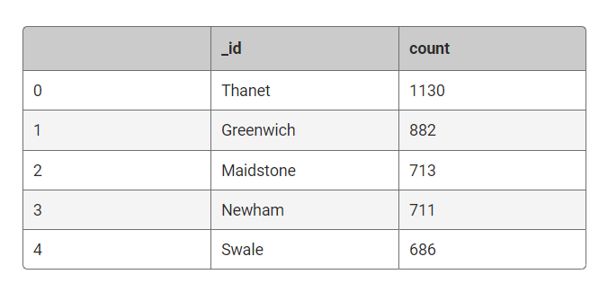

# NoSQL_Challenge
Analyzing UK Food Standards Agency's hygiene ratings data to guide Eat Safe, Love's food magazine journalists and critics in selecting establishments for future articles.

## Instructions
The UK Food Standards Agency evaluates various establishments across the United Kingdom and gives them a food hygiene rating. I've been contracted by the editors of a food magazine, Eat Safe, Love, to evaluate some of the rating data in order to help their journalists and food critics decide where to focus future articles.

### Part 1: Database and Jupyter Notebook Set Up
I'll use **NoSQL_setup_starter.ipynb** for this section of the challenge.

1: I'll import the data provided in the **establishments.json** file from my Terminal. Name the database **uk_food** and the collection **establishments**. Copy the text I used to import my data from my Terminal to a markdown cell in my notebook.

2: Within my notebook, I'll import the libraries I need: PyMongo and Pretty Print **(pprint)**.

3: I"ll create an instance of the Mongo Client.

4: I'll confirm that I created the database and loaded the data properly:

  - List the databases I have in MongoDB. Confirm that **uk_food** is listed.
  - List the collection(s) in the database to ensure that **establishments** is there.
  - Find and display one document in the **establishments** collection using find_one and display with **pprint**.

5: I"ll assign the **establishments** collection to a variable to prepare the collection for use.

### Part 2: Update the Database
I'll use **NoSQL_setup_starter.ipynb** for this section of the challenge.

The magazine editors have some requested modifications for the database before I can perform any queries or analysis for them. So, I'll Make the following changes to the **establishments** collection:

1: An exciting new halal restaurant just opened in Greenwich, but hasn't been rated yet. The magazine has asked me to include it in my analysis. So, I'll add the following information to the database:

2: I"ll find the **BusinessTypeID** for **"Restaurant/Cafe/Canteen"** and return only the **BusinessTypeID** and **BusinessType fields**.

3: Then I'll update the new restaurant with the **BusinessTypeID** I found.

4: The magazine is not interested in any establishments in Dover, so I'll check how many documents contain the Dover Local Authority.
Then, I'll remove any establishments within the Dover Local Authority from the database, and check the number of documents to ensure they were deleted.

5: Some of the number values are stored as strings, when they should be stored as numbers.

   1: I'll use **update_many** to convert **latitude** and **longitude** to decimal numbers.
   
   2: I'll use **update_many** to convert **RatingValue** to integer numbers.

### Part 3: Exploratory Analysis
Eat Safe, Love has specific questions they want me to answer, which will help them find the locations they wish to visit and avoid.
I"ll use **NoSQL_analysis_starter.ipynb** for this section of the challenge.
Some notes to be aware of while I am exploring the dataset:

- **RatingValue** refers to the overall rating decided by the Food Authority and ranges from 1-5. The higher the value, the better the rating.
    **Note:** This field also includes non-numeric values such as 'Pass', where 'Pass' means that the establishment passed their inspection but isn't given a number rating. I will coerce non-numeric values to nulls during the database setup before converting ratings to integers.
- The scores for Hygiene, Structural, and ConfidenceInManagement work in reverse. This means, the higher the value, the worse the establishment is in these areas.

I"ll use the following questions to explore the database, and find the answers, so I can provide them to the magazine editors.
Unless otherwise stated, for each question:

- I"ll use **count_documents** to display the number of documents contained in the result.
- I"ll display the first document in the results using **pprint**.
- Then I"ll convert the result to a Pandas DataFrame, print the number of rows in the DataFrame, and display the first 10 rows.

1: Which establishments have a hygiene score equal to 20?

2: Which establishments in London have a RatingValue greater than or equal to 4?

**Hint:** The London Local Authority has a longer name than "London" so I will need to use $regex as part of my search.

3: What are the top 5 establishments with a RatingValue of 5, sorted by lowest hygiene score, nearest to the new restaurant added, "Penang Flavours"?

**Hint:** I will need to compare the geocode to find the nearest locations. I"ll search within 0.01 degree on either side of the latitude and longitude.

4: How many establishments in each Local Authority area have a hygiene score of 0? I"ll sort the results from highest to lowest, and print out the top ten local authority areas.

**Hint:** I will need to use the aggregation method to answer this.
The first 5 rows of my resulting DataFrame should look something like this:

